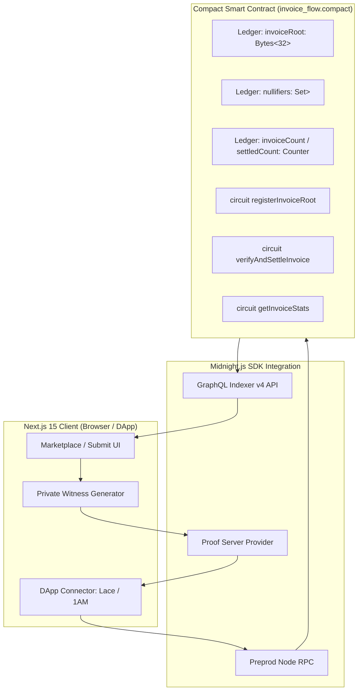

# 📄 InvoiceFlow: Product Proposal & Architecture Specification
**Level 5 — Full Moon Submission**  
**Midnight Network Preprod Track: Confidential Credentials & Private Allowlist Access (Selective Disclosure)**

---

## 1. Executive Summary

**InvoiceFlow** is a decentralized, privacy-preserving invoice financing protocol built natively on the **Midnight blockchain** using **Compact smart contracts** and **zk-SNARKs**.

In traditional finance, invoice factoring provides essential working capital for freelancers, suppliers, and small businesses by allowing them to borrow liquidity against accounts receivable. However, legacy systems require complete surrender of commercial privacy, while public transparent blockchains broadcast client names, deal margins, and cash-flow timelines to competitors.

InvoiceFlow resolves this trilemma by introducing a **dual-state confidential factoring protocol**:
1. **Confidential Witness Commitments:** Invoice amounts, client identities, and terms are proven off-chain in zero-knowledge.
2. **On-Chain Merkle Root Registry:** Only an aggregated 32-byte cryptographic Merkle root is posted to Midnight's public ledger.
3. **Anti-Double-Financing Nullifiers:** Deterministic nullifiers prevent an invoice from being financed multiple times without revealing the invoice contents.
4. **Shielded Settlement:** Liquidity providers fund invoices and receive repayments in shielded `tDUST` via the **Midnight Lace Wallet** and **1AM DApp Connector**.

---

## 2. Problem Statement & Market Need

| Stakeholder | Legacy Factoring Limitation | Public Blockchain Limitation | InvoiceFlow Resolution |
|:---|:---|:---|:---|
| **Freelancers & SMEs** | High friction (2-4 weeks), opaque credit checks, predatory discount rates (15-25%). | Competitors see all customer contracts, billing amounts, and liquidity struggles. | Instant liquidity, private invoice metadata, automated on-chain settlement. |
| **Corporate Clients** | Exposure of vendor relationships, pricing structures, and commercial agreements. | Breach of corporate confidentiality agreements and commercial NDAs. | Client identities and invoice line items remain strictly hidden in client-side witnesses. |
| **Liquidity Investors** | Opaque collateral tracking, systemic double-pledging fraud. | High gas fees, MEV front-running, public counterparty profiling. | Guaranteed non-double-financing via ZK nullifiers; trustless APY yield in shielded tokens. |

---

## 3. Product Features & Capability Matrix

### 3.1 ZK Invoice Tokenization & Commitment
- Upload invoice metadata (PDF autofill or manual entry).
- Generates client-side secret $S$, salt $R$, and leaf commitment:
  $$\text{Leaf} = \text{persistentHash}([\text{pad}(32, \text{"invoiceflow:leaf"}), S])$$
- Aggregates commitments into a 5-level Merkle tree ($\text{Vector}<5, \text{Bytes}<32>>$).
- Invokes Compact circuit `registerInvoiceRoot(newRoot)` to commit the root on Midnight Preprod.

### 3.2 Selective Disclosure & `verifyAndSettleInvoice`
- Proves inclusion of the confidential invoice inside the registered root without revealing the invoice amount or issuer private key.
- Verifies Merkle path directions ($\text{Vector}<5, \text{Boolean}>$).
- Derives deterministic nullifier:
  $$\text{Nullifier} = \text{persistentHash}([\text{pad}(32, \text{"invoiceflow:null"}), S])$$
- Enforces anti-double-financing by checking `nullifiers.member(nullifier) == false` and inserting the nullifier into the on-chain `Set<Bytes<32>>`.

### 3.3 Marketplace for Shielded Secondary Liquidity
- Investors browse verified invoices filtered by Risk Tier (Tier A, Tier B) and APY yield.
- Balances and signs unbound transactions with Midnight Lace / 1AM DApp Connector (`window.midnight.mnLace`).
- Transparent ZK fee display (~0.0125 tDUST per circuit execution).

---

## 4. Technical Architecture

---

## 5. Roadmap & Future Milestones

- **Phase 1 (Completed — Level 4/5):** Compact smart contracts, live Midnight Preprod contract deployment (`00646ed7...`), 50+ onboarded testnet users, feedback loop integration.
- **Phase 2 (Q4 2026):** Multi-party threshold decryption for corporate audit view keys; secondary fractional invoice tranches.
- **Phase 3 (Q1 2027):** Mainnet deployment on Midnight Network with cross-chain Cardano liquidity bridges.

---

## 6. Project Verification Links

- **Repository:** [https://github.com/rishi3243kumar/InvoiceFlows](https://github.com/rishi3243kumar/InvoiceFlows)
- **Live DApp:** [https://invoice-flows.vercel.app/](https://invoice-flows.vercel.app/)
- **Preprod Contract Address:** `00646ed78c2a6ac9fcc28cb5db6e6349567995e272ab91486dd9bbc123ef0406`
- **Explorer:** [Midnight Explorer Contract Link](https://preprod.midnightexplorer.com/contracts/00646ed78c2a6ac9fcc28cb5db6e6349567995e272ab91486dd9bbc123ef0406)
- **Official X Profile:** [@InvoiceFlows](https://x.com/InvoiceFlows)
