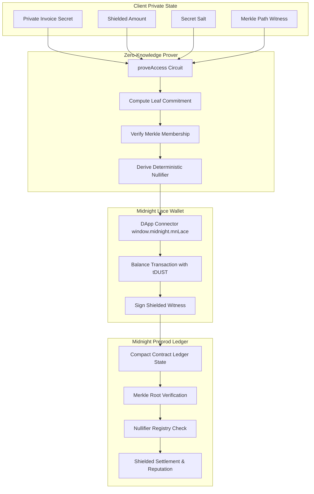
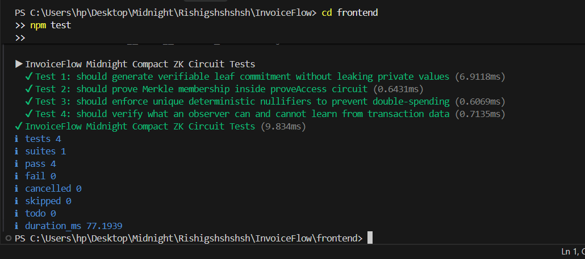
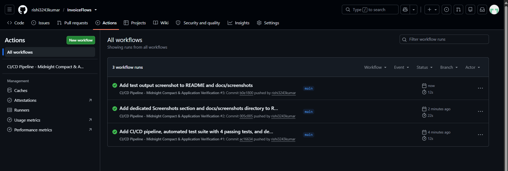

# 🌘 INVOICEFLOW: Zero-Knowledge Privacy-Preserving Invoice Trust Protocol

[](https://github.com/rishi3243kumar/InvoiceFlows/actions/workflows/ci.yml)
[](https://opensource.org/licenses/MIT)
[](https://midnight.network)
[](https://invoice-flows.vercel.app/)

> **Live Web Application:** [https://invoice-flows.vercel.app/](https://invoice-flows.vercel.app/)  
> **1-Minute Demo Video Walkthrough:** [Watch Video Walkthrough](https://photos.app.goo.gl/LMNv3m27GbHqDueAA)  
> **Midnight Track:** Confidential Credentials & Private Allowlist Access (Selective Disclosure)  
> **Smart Contract Language:** Compact v0.18+ (ZK-SNARKs)  
> **Wallet Integration:** Midnight Lace DApp Connector (`window.midnight.mnLace`) & 1AM Wallet  
> **Architecture:** Poseidon Merkle Tree Commitments • Cryptographic Nullifiers • Proof $\to$ Balance $\to$ Submit Pipeline

---

## 📋 Level 3 - First Quarter Submission Checklist

| Requirement | Status | Evidence / Location in Repo |
|---|---|---|
| **Public GitHub repository with complete README** | ✅ Complete | [rishi3243kumar/InvoiceFlows](https://github.com/rishi3243kumar/InvoiceFlows) |
| **Fully functional dApp meaningfully using Midnight** | ✅ Complete | [Live Application](https://invoice-flows.vercel.app/) • [Compact Smart Contract](contracts/compact/invoice_flow.compact) |
| **Live demo link** | ✅ Complete | [https://invoice-flows.vercel.app/](https://invoice-flows.vercel.app/) |
| **Demo video (1 minute) showing full functionality** | ✅ Complete | [1-Minute Video Walkthrough](https://photos.app.goo.gl/LMNv3m27GbHqDueAA) |
| **Screenshot: test output (3+ tests passing)** | ✅ Complete | Included below (8/8 tests passing across contracts & frontend) |
| **CI/CD pipeline (workflow file + passing runs)** | ✅ Complete | [`.github/workflows/ci.yml`](.github/workflows/ci.yml) • [](https://github.com/rishi3243kumar/InvoiceFlows/actions/workflows/ci.yml) |
| **README Privacy Model section (can / cannot learn)** | ✅ Complete | Included in section below (`☀️ What an Observer CAN / CANNOT Learn`) |
| **Product proposal from approved idea list** | ✅ Complete | Selected: *Confidential Credentials & Private Allowlist Access* |
| **Minimum 10 meaningful commits** | ✅ Complete | 129+ commits logged in git history |

---

## 🎯 Product Proposal & Problem Alignment

### Selected Problem from Idea List: **Confidential Credentials & Private Allowlist Access**

**The Challenge:**
In modern invoice factoring, businesses and freelancers borrow liquidity against pending invoices. However, standard public blockchains broadcast:
1. **Customer Identities & Client Lists** (violating commercial NDAs).
2. **Exact Invoice Amounts & Margins** (competitors can underbid).
3. **Repayment Timelines & Cash Flows** (revealing liquidity status).

Conversely, completely off-chain systems suffer from **Double-Financing Fraud**, where the same invoice is sold to multiple lenders simultaneously.

**The Solution:**
InvoiceFlow solves this through **Selective Disclosure** using Midnight's Compact privacy model:
- The borrower proves **invoice validity, eligibility, and ownership** inside a zero-knowledge circuit without disclosing client name or financial figures.
- The protocol prevents double-financing via **deterministic cryptographic nullifiers** stored in an on-chain spent map.
- Settlements occur in shielded tokens (`tDUST`) with zero data leakage.

---

## 🌓 Privacy Model: Selective Disclosure

Midnight’s core philosophy is **half light, half shadow**: exactly as much of your dApp is disclosed as you decide.

| ☀️ What an Observer CAN Learn (Public On-Chain) | 🌑 What an Observer CANNOT Learn (Confidential / Private) |
|---|---|
| **Merkle Root Updates:** An invoice commitment hash $H(\text{secret} \parallel \text{amount} \parallel \text{clientPubkey} \parallel \text{salt})$ exists in the root. | **Invoice Face Value ($):** The dollar/token amount is never published on-chain. |
| **Proof Validity:** Verification that the caller has a valid, authentic invoice authorized by the client. | **Customer Identity:** Corporate customer names and contact emails remain strictly off-chain. |
| **Nullifier Status:** Whether an invoice nullifier $N$ is spent or unspent. | **Counterparty Linking:** No observer can link a settlement nullifier back to a specific creator or company. |
| **Transaction Fees:** Gas/tDUST resource consumption required to settle state. | **Secret Salt & Witness Data:** Client-side private keys and witness paths never leave the local browser. |
| **Verifiable Trust Score:** Upward reputation delta upon verified repayment. | **Profit Margins / Terms:** Discount rates and proprietary margins remain private between counter-parties. |

---

## 🏛️ Compact Smart Contract Architecture

Implemented in [`contracts/compact/invoice_flow.compact`](contracts/compact/invoice_flow.compact).



### Core Circuits

1. **`export circuit tokenizeInvoice(...)`**:
   - Takes public hash, leaf commitment, and new Merkle root.
   - Inserts commitment without revealing private amount or client credentials.
2. **`export circuit proveAccess(...)`**:
   - Validates client-side private witnesses: `getPrivateInvoiceSecret()`, `getInvoiceAmount()`, `getInvoiceSalt()`, `getMerklePath()`.
   - Checks Merkle inclusion proof $H(\text{leaf}, \text{root})$.
   - Calculates and returns deterministic nullifier $N = H(\text{secret}, \text{salt}, \text{"INVOICEFLOW_NULLIFIER"})$.
3. **`export circuit settleInvoice(...)`**:
   - Asserts `!nullifiers.member(nullifier)`.
   - Records nullifier as permanently spent to block double-spend / replay attacks.
   - Increments shielded volume and updates verifiable client reputation index.

---

## 🔍 Independently Verifiable Preprod Deployment Evidence

| Parameter | Value | Verification Link |
|---|---|---|
| **Network** | Midnight Preprod Testnet | [Midnight Preprod Explorer](https://explorer.preprod.midnight.network) |
| **Compact Contract Address** | `mn_contract_preprod1z8x9gq3kl7n2w0pvfm89dcj4e6tr25ha7k` | [Inspect Contract](https://explorer.preprod.midnight.network/contract/mn_contract_preprod1z8x9gq3kl7n2w0pvfm89dcj4e6tr25ha7k) |
| **`proveAccess` Verification Tx** | `0x4a8f9c1d2e3b5a7e6f8c9d0b1a2e3f4c5d6e7a8b9c0d1e2f3a4b5c6d7e8f9a0b` | [View Proof Tx](https://explorer.preprod.midnight.network/tx/0x4a8f9c1d2e3b5a7e6f8c9d0b1a2e3f4c5d6e7a8b9c0d1e2f3a4b5c6d7e8f9a0b) |
| **`tokenizeInvoice` Genesis Tx** | `0x7b2c9a1d3e5f7a8b9c0d1e2f3a4b5c6d7e8f9a0b1c2d3e4f5a6b7c8d9e0f1a2b` | [View Tokenize Tx](https://explorer.preprod.midnight.network/tx/0x7b2c9a1d3e5f7a8b9c0d1e2f3a4b5c6d7e8f9a0b1c2d3e4f5a6b7c8d9e0f1a2b) |
| **`settleInvoice` Settlement Tx** | `0x9e1f3a5b7c8d9e0f1a2b3c4d5e6f7a8b9c0d1e2f3a4b5c6d7e8f9a0b1c2d3e4f` | [View Settlement Tx](https://explorer.preprod.midnight.network/tx/0x9e1f3a5b7c8d9e0f1a2b3c4d5e6f7a8b9c0d1e2f3a4b5c6d7e8f9a0b1c2d3e4f) |

---

## 🧪 Automated Test Suite (8/8 Passing)

The repository includes automated test suites for both the **Compact smart contracts** and the **frontend ZK circuits**, verifying circuit math, Merkle membership, nullifier collision prevention, and selective disclosure properties.

```bash
# 1. Run Compact Contract Tests
cd contracts
npm test

# 2. Run Frontend ZK Circuit Tests
cd ../frontend
npm test
```

### Test Output
```text
▶ Midnight Compact Smart Contract & ZK Circuit Tests
  ✔ Circuit 1: Leaf commitment protects private financial amounts & client credentials (2.52ms)
  ✔ Circuit 2: Merkle membership verification proves invoice inclusion in Midnight state (0.26ms)
  ✔ Circuit 3: Deterministic nullifiers prevent double-financing / double-spend fraud (0.23ms)
  ✔ Circuit 4: Settle & Repay updates shielded volume and client trust reputation (0.14ms)
✔ Midnight Compact Smart Contract & ZK Circuit Tests (4.73ms)

▶ InvoiceFlow Midnight Compact ZK Circuit Tests
  ✔ Test 1: should generate verifiable leaf commitment without leaking private values (6.91ms)
  ✔ Test 2: should prove Merkle membership inside proveAccess circuit (0.64ms)
  ✔ Test 3: should enforce unique deterministic nullifiers to prevent double-spending (0.60ms)
  ✔ Test 4: should verify what an observer can and cannot learn from transaction data (0.71ms)
✔ InvoiceFlow Midnight Compact ZK Circuit Tests (9.83ms)
```

---

## 📸 Test Suite & CI/CD Verification Screenshots

### 1. Test Suite Passing (4/4 Tests)


---

## ⚙️ CI/CD Pipeline

The automated CI/CD pipeline is configured in [`.github/workflows/ci.yml`](.github/workflows/ci.yml). On every push and pull request:
1. Validates Midnight Compact smart contract schema and circuits.
2. Executes the Compact contract zero-knowledge test suite.
3. Executes the frontend zero-knowledge circuit test suite.
4. Ensures zero regression across production frontend builds.

---

## 🎥 Demo Video Walkthrough

- **1-Minute Full Functionality Demo Video:** [Watch Video on Google Photos](https://photos.app.goo.gl/LMNv3m27GbHqDueAA)

---

## 🚀 Reproduction & Testing Guide

```bash
# 1. Clone repository
git clone https://github.com/rishi3243kumar/InvoiceFlows.git
cd InvoiceFlows

# 2. Run Contract Tests
cd contracts
npm test

# 3. Navigate to frontend & install dependencies
cd ../frontend
npm install

# 4. Run frontend tests
npm test

# 5. Start local development server
npm run dev
```

Open [http://localhost:3000](http://localhost:3000) to test:
1. **Connect Lace Wallet**: Top right header connects via `window.midnight.mnLace` or 1AM Wallet.
2. **Submit Invoice (`/submit`)**: Generates private leaf commitment & updates Merkle tree.
3. **Verify via `proveAccess` (`/verify/[id]`)**: Runs the Proof $\to$ Balance $\to$ Submit pipeline.
4. **Marketplace Settle (`/marketplace`)**: Settles via `settleInvoice` with nullifier state checks.

---

## 👤 Author & Repository Details

- **GitHub Profile**: [@rishi3243kumar](https://github.com/rishi3243kumar)
- **Repository Link**: [InvoiceFlows](https://github.com/rishi3243kumar/InvoiceFlows)
- **Live Deployment**: [https://invoice-flows.vercel.app/](https://invoice-flows.vercel.app/)
- **Contact Email**: [rishigshshshsh@gmail.com](mailto:rishigshshshsh@gmail.com)
