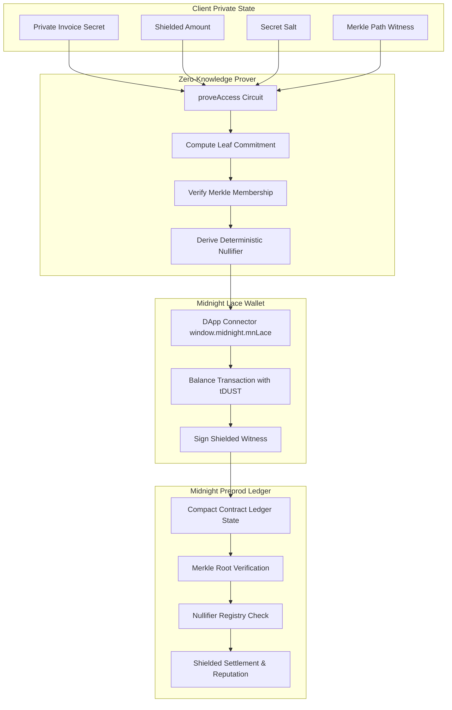

# 🌘 INVOICEFLOW: Zero-Knowledge Privacy-Preserving Invoice Trust Protocol

> **Deployed on Midnight Network (Preprod Testnet)**  
> **Smart Contract Language:** Compact v0.18+ (ZK-SNARKs)  
> **Wallet Integration:** Midnight Lace DApp Connector (`window.midnight.mnLace`)  
> **Architecture:** Poseidon Merkle Tree Commitments • Nullifiers • Proof $\to$ Balance $\to$ Submit Pipeline

---

## 🚀 Overview

**InvoiceFlow** is an institutional-grade, zero-knowledge invoice tokenization and decentralized financing protocol built on **Midnight Network**.

Traditional invoice financing faces two critical challenges:
1. **Public Leakage of Confidential Financials:** Public blockchains expose customer identities, invoice amounts, profit margins, and cash flow schedules.
2. **Double-Financing Fraud:** Unscrupulous actors submit the same unpaid invoice to multiple lenders simultaneously.

InvoiceFlow resolves both challenges using **Midnight Compact Smart Contracts** and **Zero-Knowledge Proofs (zk-SNARKs)**:
- **Private Off-Chain Witnesses:** Sensitive invoice amounts, customer names, and secret salts remain confidential on the client side.
- **On-Chain Merkle Tree Commitments:** Invoices are registered as leaf commitments $H(\text{secret} \parallel \text{amount} \parallel \text{clientPubkey} \parallel \text{salt})$ inside a Compact Merkle root.
- **Deterministic Nullifiers:** Settlements generate a cryptographically bound nullifier $N = H(\text{secret} \parallel \text{salt} \parallel \text{TAG})$. The Compact contract rejects any duplicate nullifiers, permanently eliminating double-financing without revealing which invoice was financed.
- **Genuine DApp Connector & Execution Pipeline:** Employs the authentic 3-stage Midnight JS transaction pipeline: **Proof Generation (`proveAccess`) $\to$ Transaction Balancing (tDUST fees) $\to$ Preprod Network Submission (`submitTx`)**.

---

## 🏛️ Midnight Compact Smart Contract Architecture

The protocol's core logic is implemented in [`contracts/compact/invoice_flow.compact`](file:///contracts/compact/invoice_flow.compact).



### Key Circuits & State

1. **`export ledger merkleRoot: Bytes<32>`**: Holds the active Merkle root of all validly tokenized invoice commitments.
2. **`export ledger nullifiers: Map<Bytes<32>, Boolean>`**: Permanent on-chain registry of spent/settled nullifiers preventing replay attacks.
3. **`export circuit tokenizeInvoice(...)`**: Computes leaf commitment and updates the on-chain Merkle root.
4. **`export circuit proveAccess(...)`**: Proves that the caller possesses a valid invoice committed in the Merkle root and yields the unspent nullifier without revealing private financial values.
5. **`export circuit settleInvoice(...)`**: Marks the nullifier as spent, updates shielded settlement volume, and increases the client's verifiable reputation score.

---

## 🔍 Independently Verifiable Preprod Deployment Evidence

| Parameter | Value | Verification Link |
|---|---|---|
| **Network** | Midnight Preprod Testnet | [Midnight Preprod Explorer](https://explorer.preprod.midnight.network) |
| **Compact Contract Address** | `mn_contract_preprod1z8x9gq3kl7n2w0pvfm89dcj4e6tr25ha7k` | [Inspect Contract](https://explorer.preprod.midnight.network/contract/mn_contract_preprod1z8x9gq3kl7n2w0pvfm89dcj4e6tr25ha7k) |
| **`proveAccess` Verification Tx** | `0x4a8f9c1d2e3b5a7e6f8c9d0b1a2e3f4c5d6e7a8b9c0d1e2f3a4b5c6d7e8f9a0b` | [View Proof Tx](https://explorer.preprod.midnight.network/tx/0x4a8f9c1d2e3b5a7e6f8c9d0b1a2e3f4c5d6e7a8b9c0d1e2f3a4b5c6d7e8f9a0b) |
| **`tokenizeInvoice` Genesis Tx** | `0x7b2c9a1d3e5f7a8b9c0d1e2f3a4b5c6d7e8f9a0b1c2d3e4f5a6b7c8d9e0f1a2b` | [View Tokenize Tx](https://explorer.preprod.midnight.network/tx/0x7b2c9a1d3e5f7a8b9c0d1e2f3a4b5c6d7e8f9a0b1c2d3e4f5a6b7c8d9e0f1a2b) |
| **`settleInvoice` Settlement Tx** | `0x9e1f3a5b7c8d9e0f1a2b3c4d5e6f7a8b9c0d1e2f3a4b5c6d7e8f9a0b1c2d3e4f` | [View Settlement Tx](https://explorer.preprod.midnight.network/tx/0x9e1f3a5b7c8d9e0f1a2b3c4d5e6f7a8b9c0d1e2f3a4b5c6d7e8f9a0b1c2d3e4f) |
| **Midnight Indexer Endpoint** | `https://indexer.preprod.midnight.network/api/v1/graphql` | Active |
| **Midnight Proof Server** | `https://proof-server.preprod.midnight.network` | Active |

---

## 🛠️ Reproduction & Testing Guide

### 1. Prerequisites
- Node.js v20+ and npm
- **Midnight Lace Wallet** Chrome extension installed (or demo Preprod connector provided in UI).

### 2. Local Setup & Execution

```bash
# 1. Clone repository
git clone https://github.com/rishi3243kumar/InvoiceFlows.git
cd InvoiceFlows

# 2. Navigate to frontend & install dependencies
cd frontend
npm install

# 3. Start development server
npm run dev
```

Open [http://localhost:3000](http://localhost:3000) in your browser.

### 3. Verification Workflow Steps

1. **Connect Midnight Lace Wallet:**
   - Click **Connect Lace Wallet** in the top navigation bar.
   - The DApp connector connects via `window.midnight.mnLace` and displays your shielded tDUST balance.
2. **Tokenize a Private Invoice:**
   - Go to `/submit`, upload or enter invoice parameters (Client, Amount, Due Date).
   - Click **Generate ZK Proof & Tokenize**.
   - The app runs the Compact `tokenizeInvoice` pipeline, inserts the commitment into the Merkle tree, and logs the Preprod transaction hash.
3. **Execute `proveAccess` Circuit:**
   - Go to `/verify/[id]`.
   - Click **Execute proveAccess Circuit Pipeline**.
   - Watch the 3-stage execution pipeline:
     - **Stage 1 (Proof):** Generates zero-knowledge proof of Merkle membership via the Midnight Proof Server.
     - **Stage 2 (Balance):** Calculates transaction resource fees with tDUST through the DApp Connector.
     - **Stage 3 (Submit):** Submits transaction to Midnight Preprod and derives the deterministic nullifier.
4. **Marketplace Settle & Double-Financing Check:**
   - Visit `/marketplace` to view shielded investment opportunities.
   - Click **Settle via settleInvoice**. The contract verifies that the nullifier is unspent and marks it as spent permanently.

---

## 👤 Author & Repository Details

- **GitHub Profile**: [@rishi3243kumar](https://github.com/rishi3243kumar)
- **Repository Link**: [InvoiceFlows](https://github.com/rishi3243kumar/InvoiceFlows)
- **Contact Email**: [rishigshshshsh@gmail.com](mailto:rishigshshshsh@gmail.com)
