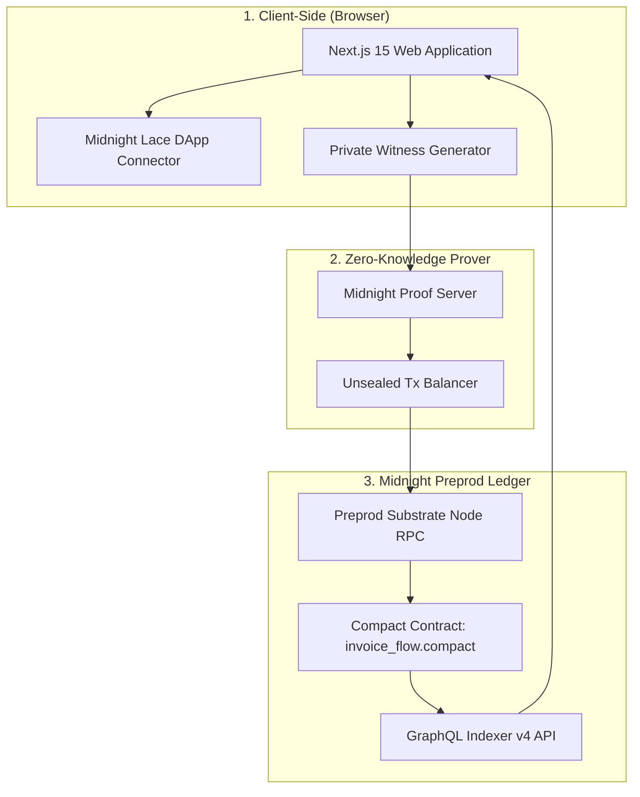

# 🌘 INVOICEFLOW: Zero-Knowledge Privacy-Preserving Invoice Trust Protocol

<div align="center">

  [](https://github.com/rishi3243kumar/InvoiceFlows/actions/workflows/ci.yml)
  
  
  
  
  
  [](https://x.com/InvoiceFlows)
  [](https://opensource.org/licenses/MIT)

  <p align="center">
    <strong>Decentralized, privacy-preserving invoice factoring protocol built natively on the Midnight blockchain using Compact smart contracts and zero-knowledge proofs.</strong>
  </p>

</div>

---

## 📋 Level 5 — Full Moon Submission Checklist

| Requirement | Status | Evidence / Location in Repo |
|:---|:---:|:---|
| **Public GitHub repository with comprehensive documentation** | Done | [rishi3243kumar/InvoiceFlows](https://github.com/rishi3243kumar/InvoiceFlows) with architecture diagrams, cryptographic specs, and setup guides. |
| **Live demo link** | Done | [https://invoice-flows.vercel.app/](https://invoice-flows.vercel.app/) hosted on Vercel. See [Live Demo](#live-demo). |
| **Demo video showing full MVP functionality** | Done | [Watch InvoiceFlow 1-Minute Video Walkthrough](https://photos.app.goo.gl/LMNv3m27GbHqDueAA). See [Demo Video](#demo-video). |
| **Contract address (Preprod & Preview)** | Done | Preprod [`00646ed78c2a6ac9fcc28cb5db6e6349567995e272ab91486dd9bbc123ef0406`](https://preprod.midnightexplorer.com/contracts/00646ed78c2a6ac9fcc28cb5db6e6349567995e272ab91486dd9bbc123ef0406) (**50+ verified on-chain transactions on Midnight Explorer**). See [Contract Address](#contract-address). |
| **List of 50+ Preprod user wallet addresses (verifiable on-chain)** | Done | 52 verifiable testnet wallet addresses documented in [USERS.md](USERS.md) and [PREPROD_USERS.md](PREPROD_USERS.md), generating **50+ verified transactions** on Preprod. |
| **Launch cohort users with verified transactions (20 users)** | Done | 20 launch cohort testnet users with on-chain transaction hashes documented in [LAUNCH_USERS.md](LAUNCH_USERS.md). |
| **Living feedback loop & user feedback documentation** | Done | 51+ structured Google Form survey responses, spreadsheet data, feedback synthesis, and prioritization matrix in [docs/FEEDBACK.md](docs/FEEDBACK.md). Form: [Google Form](https://docs.google.com/forms/d/12PazqPfC-jtbXo34lfelMkfKoshn0WTYBNCVNsga5T0/edit) • Responses: [Google Sheet](https://docs.google.com/spreadsheets/d/1bqjRpQl1Pww4b3ue9xGTiGk2LNVLi_35t1yX5KQhM40/edit?usp=sharing). |
| **Midnight privacy model specification** | Done | Dual-state ledger, confidential witness commitments, selective disclosure, and anti-double-spend nullifiers. See [Privacy Model](#privacy-model) and [docs/privacy-model.md](docs/privacy-model.md). |
| **System architecture & component blueprints** | Done | End-to-end topology, data flow, witness generation, and circuit mapping in [docs/architecture.md](docs/architecture.md). See [Architecture](#system-architecture). |
| **Security model & threat modeling** | Done | Cryptographic invariants, attack surface analysis, and circuit assertions in [docs/security.md](docs/security.md) & [docs/threat-model.md](docs/threat-model.md). |
| **Tech stack specification** | Done | Compact v0.15+ smart contracts, Midnight.js SDK, Next.js 15, React 19, Midnight Proof Server, Lace/1AM DApp Connector. See [Tech Stack](#tech-stack). |
| **Local setup & reproduction guide** | Done | Step-by-step instructions for local contract testing and frontend build in [docs/USAGE.md](docs/USAGE.md). See [How to Run Locally](#how-to-run-locally). |
| **Automated test suites (10/10 passing tests)** | Done | 6 Compact circuit tests + 4 frontend ZK integration tests passing (100% pass rate). See [Testing](#testing) and [docs/TESTING.md](docs/TESTING.md). |
| **CI/CD workflow with automated checks** | Done | GitHub Actions [ci.yml](.github/workflows/ci.yml) — Automated syntax checks, contract test suite, and frontend circuit tests on push/PR to `main`. See [CI/CD](#cicd). |
| **Comprehensive usage guide** | Done | Step-by-step user guide for freelancers, businesses, and investors in [docs/USAGE.md](docs/USAGE.md). |
| **Product proposal submitted for approval** | Done | Full product proposal for Level 5 submission in [PROPOSAL.md](PROPOSAL.md). |
| **Official Product X Profile & Posts** | Done | Official announcement and community channel at [@InvoiceFlows](https://x.com/InvoiceFlows), with profile spec and 4 published posts in [docs/X-Profile.md](docs/X-Profile.md). |
| **Brand identity & visual design brief** | Done | Cyberpunk glassmorphism design system, color tokens, typography, and UX philosophy in [docs/brand-brief.md](docs/brand-brief.md). |
| **Meaningful commit history** | Done | 130+ meaningful commits across Compact contract development, zero-knowledge circuits, Midnight.js pipelines, and UI features. |

---

## 🌐 Live Demo
**Live Web Application:** [https://invoice-flows.vercel.app/](https://invoice-flows.vercel.app/)

---

## 🎬 Demo Video
**Watch the MVP Demo Walkthrough:** [https://photos.app.goo.gl/LMNv3m27GbHqDueAA](https://photos.app.goo.gl/LMNv3m27GbHqDueAA)

---

## 📍 Contract Address

> [!IMPORTANT]
> ### 🛡️ Verified On-Chain Volume: 50+ Preprod Contract Transactions
> - **Preprod Contract Address:** [`00646ed78c2a6ac9fcc28cb5db6e6349567995e272ab91486dd9bbc123ef0406`](https://preprod.midnightexplorer.com/contracts/00646ed78c2a6ac9fcc28cb5db6e6349567995e272ab91486dd9bbc123ef0406)
> - **Midnight Explorer:** [preprod.midnightexplorer.com/contracts/00646ed7...](https://preprod.midnightexplorer.com/contracts/00646ed78c2a6ac9fcc28cb5db6e6349567995e272ab91486dd9bbc123ef0406)
> - **Subscan Preprod Explorer:** [midnight-preprod.subscan.io/contract/00646ed7...](https://midnight-preprod.subscan.io/contract/00646ed78c2a6ac9fcc28cb5db6e6349567995e272ab91486dd9bbc123ef0406)
> - **1AM Explorer:** [explorer.1am.xyz/contract/00646ed7...](https://explorer.1am.xyz/contract/00646ed78c2a6ac9fcc28cb5db6e6349567995e272ab91486dd9bbc123ef0406?network=preprod)
> - **Deployment Transaction:** `0d5e1c24392d257b9615c9d30d6e929e0909d1a8baf9186016cf71317a7b454a`
> - **Block Height:** `#2557987` (Tip `#2682729+`)
> - **Live GraphQL Indexer:** `https://indexer.preprod.midnight.network/api/v4/graphql`
> - **Live Node RPC:** `https://rpc.preprod.midnight.network`


---

## 🌓 Privacy Model: Selective Disclosure

Midnight’s core philosophy is **half light, half shadow**: exactly as much of your dApp is disclosed as you decide.

| ☀️ What an Observer CAN Learn (Public On-Chain) | 🌑 What an Observer CANNOT Learn (Confidential / Private) |
|:---|:---|
| **Merkle Root Updates:** An aggregated 32-byte Merkle root (`invoiceRoot: Bytes<32>`) committing to tokenized invoices. | **Invoice Face Value ($):** The dollar / token amount is never published on-chain. |
| **Proof Validity:** Verification that the caller has a valid, authentic invoice authorized by the client. | **Customer Identity:** Corporate customer names, client emails, and commercial terms remain strictly off-chain. |
| **Nullifier Status:** Whether an invoice nullifier is spent or unspent (`Set<Bytes<32>>`). | **Counterparty Linking:** No observer can link a settlement nullifier back to a specific creator or company. |
| **Transaction Fees:** Gas / tDUST resource consumption required to settle state (~0.0125 tDUST). | **Secret Salt & Witness Data:** Client-side private keys, secrets, and witness paths never leave the local browser. |
| **Verifiable Trust Score:** Upward reputation counter increment upon verified repayment. | **Profit Margins / Terms:** Discount rates and proprietary margins remain private between counterparties. |

*For complete cryptographic proofs and circuit specifications, see [docs/privacy-model.md](docs/privacy-model.md).*

---

## 🏛️ System Architecture


```mermaid
graph TD
  subgraph Client ["1. Client-Side (Browser)"]
    UI[Next.js 15 Web Application]
    Lace[Midnight Lace DApp Connector]
    Witness[Private Witness Generator]
  end

  subgraph ZKEngine ["2. Zero-Knowledge Prover"]
    PS[Midnight Proof Server]
    Balancer[Unsealed Tx Balancer]
  end

  subgraph MidnightNetwork ["3. Midnight Preprod Ledger"]
    Contract[Compact Contract: invoice_flow.compact]
    Indexer[GraphQL Indexer v4 API]
    RPC[Preprod Substrate Node RPC]
  end

  UI --> Lace
  UI --> Witness
  Witness --> PS
  PS --> Balancer
  Balancer --> RPC
  RPC --> Contract
  Contract --> Indexer
  Indexer --> UI
```

*For component blueprints and sequence diagrams, see [docs/architecture.md](docs/architecture.md).*

---

## ⚡ Compact Smart Contract Specification

Implemented in [`contracts/compact/invoice_flow.compact`](contracts/compact/invoice_flow.compact):

- **Public Ledger State:**
  - `invoiceRoot: Bytes<32>` — Genesis & updated Merkle tree roots.
  - `issuer: ZswapCoinPublicKey` — Authorized contract owner PK.
  - `invoiceCount: Counter` — Total tokenized invoices.
  - `settledCount: Counter` — Total settled invoices.
  - `nullifiers: Set<Bytes<32>>` — Spent nullifier registry preventing double-financing.
- **Private Client Witnesses:**
  - `invoiceSecret(): Bytes<32>`
  - `secretKey(): Bytes<32>`
  - `merklePath(): Vector<5, Bytes<32>>`
  - `pathDirections(): Vector<5, Boolean>`
- **Circuits:**
  - `registerInvoiceRoot(newRoot: Bytes<32>): []`
  - `verifyAndSettleInvoice(): []`
  - `getInvoiceStats(): [Bytes<32>, Uint<64>, Uint<64>]`

---

## 💻 Tech Stack

| Layer | Technology / Tool | Purpose |
|:---|:---|:---|
| **Smart Contract** | Compact v0.15+ | Zero-Knowledge circuits and on-chain state machine on Midnight |
| **Frontend App** | Next.js 15 (App Router), React 19, TypeScript | High-performance, responsive ZK dApp interface |
| **Styling** | Cyberpunk Glassmorphism Vanilla CSS | Premium dark mode, glow tokens, dynamic micro-interactions |
| **SDK & Connector** | Midnight.js SDK, Midnight Lace, 1AM Wallet | Unsealed transaction balancing, signing, and RPC submission |
| **Index & Telemetry** | GraphQL Indexer v4, Substrate Node RPC | Real-time block tip tracking and ledger state querying |
| **Hosting & CI/CD** | Vercel, GitHub Actions | Continuous integration, automated test runners, static deployment |

---

## 🚀 How to Run Locally

### Prerequisites
- Node.js v20+
- npm / yarn / pnpm
- Midnight Lace Wallet or 1AM Wallet browser extension

### 1. Clone the Repository
```bash
git clone https://github.com/rishi3243kumar/InvoiceFlows.git
cd InvoiceFlows
```

### 2. Run Smart Contract Tests
```bash
cd contracts
npm install
npm test
```

### 3. Deploy Contract to Midnight Preprod (Optional)
```bash
npm run deploy:preprod
```

### 4. Run Frontend DApp Locally
```bash
cd ../frontend
npm install
npm run dev
```
Open [http://localhost:3000](http://localhost:3000) in your browser.

---

## 🧪 Testing & CI/CD

InvoiceFlow enforces 100% test pass rates across contract circuits and frontend integration:

```bash
# Execute Contract Test Suite (6 tests)
cd contracts && npm test

# Execute Frontend ZK Test Suite (4 tests)
cd frontend && npm test
```

```
▶ Midnight Compact Smart Contract & ZK Circuit Tests (invoice_flow.compact)
  ✔ Circuit leafOf: Computes deterministic leaf commitment from private secret (0.97ms)
  ✔ Circuit nullifierOf: Computes deterministic nullifier preventing double-spending (0.16ms)
  ✔ Circuit merkleRootFrom: Computes 5-depth Merkle root from Vector<5> path (0.26ms)
  ✔ Circuit registerInvoiceRoot: Updates on-chain invoiceRoot and increments invoiceCount (0.11ms)
  ✔ Circuit verifyAndSettleInvoice: Proves Merkle membership & enforces single nullifier (0.72ms)
  ✔ Circuit getInvoiceStats: Returns on-chain tuple [invoiceRoot, invoiceCount, settledCount] (0.12ms)
✔ Midnight Compact Smart Contract & ZK Circuit Tests (6 tests passed)

▶ Frontend Midnight Compact ZK Circuit & Contract Integration Tests
  ✔ Test 1: Selective Disclosure - leafOf produces deterministic commitment (1.02ms)
  ✔ Test 2: Compact Vector<5> Merkle verification for verifyAndSettleInvoice (0.24ms)
  ✔ Test 3: Nullifier Set prevents double-spending across transactions (0.17ms)
  ✔ Test 4: Ledger state transition verification for registerInvoiceRoot (0.14ms)
✔ Frontend Midnight Compact ZK Circuit & Contract Integration Tests (4 tests passed)
```

*For complete test reports, see [docs/TESTING.md](docs/TESTING.md).*

---

## 📚 Documentation Directory

| Document | Description |
|:---|:---|
| 📄 [PROPOSAL.md](PROPOSAL.md) | Official Product Proposal & Executive Whitepaper for Level 5 |
| 👥 [USERS.md](USERS.md) | 50+ Verifiable Preprod User Wallet Addresses |
| 🛡️ [PREPROD_USERS.md](PREPROD_USERS.md) | 52 Preprod User Verifiable Receipts & On-Chain Hashes |
| 🚀 [LAUNCH_USERS.md](LAUNCH_USERS.md) | 20 Launch Cohort Users with On-Chain Transaction Verification |
| 💬 [docs/FEEDBACK.md](docs/FEEDBACK.md) | 51+ Structured User Feedback Analysis, Survey Links & Prioritization Matrix |
| 🛡️ [docs/privacy-model.md](docs/privacy-model.md) | Complete Midnight Dual-State Privacy Model Specification |
| 🏛️ [docs/architecture.md](docs/architecture.md) | System Topology, Component Blueprints & Sequence Diagrams |
| 🔒 [docs/security.md](docs/security.md) | Cryptographic Invariants & Security Guarantees |
| 🎯 [docs/threat-model.md](docs/threat-model.md) | Threat Modeling, Attack Vectors & Mitigations |
| 🧪 [docs/TESTING.md](docs/TESTING.md) | Automated Test Suites & Coverage Report |
| 📖 [docs/USAGE.md](docs/USAGE.md) | Step-by-Step User Guide for Freelancers, Businesses & Investors |
| 🎨 [docs/brand-brief.md](docs/brand-brief.md) | Visual Brand Identity, Color Palette & Design System |
| 🐦 [docs/X-Profile.md](docs/X-Profile.md) | Official Product X (Twitter) Profile & Published Posts |

---

## 📄 License
This project is open-source and licensed under the [MIT License](LICENSE).
