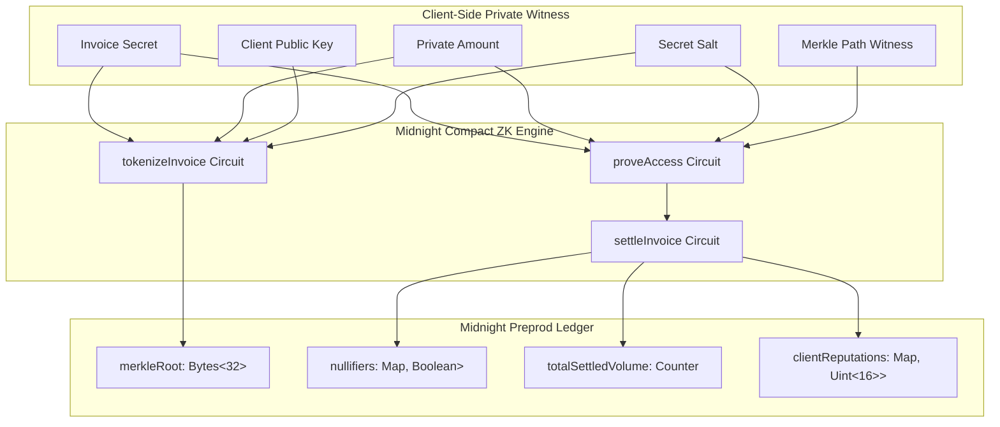

# 🌘 Midnight Compact Smart Contracts: InvoiceFlow

This package contains the **Compact smart contracts**, zero-knowledge circuits, client-side witness generators, and deployment infrastructure for **InvoiceFlow** on the **Midnight Network**.

---

## 🏛️ Architecture Overview



---

## 📄 Compact Contract: `compact/invoice_flow.compact`

The core contract is written in **Compact (Midnight Network v0.18+)** and provides:

1. **`initialize(initialRoot: Bytes<32>)`**: Sets genesis Merkle tree state.
2. **`tokenizeInvoice(invoiceIdHash, commitment, newMerkleRoot, dueTimestamp, riskTier)`**: Inserts a blinded invoice leaf commitment without exposing underlying financial values or client credentials.
3. **`proveAccess(clientPubkey, claimedInvoiceId)`**: Verifies private witnesses and Merkle inclusion inside zero-knowledge proof, returning a deterministic nullifier.
4. **`settleInvoice(invoiceIdHash, nullifier, settledAmount, clientHash)`**: Atomically marks the nullifier as spent on-chain to permanently eliminate double-financing, and boosts the borrower's on-chain trust score.

---

## 🧪 Testing

To run the automated Compact circuit test suite:

```bash
npm test
```

## 🚀 Deployment

To deploy and initialize the Compact contract to Midnight Preprod:

```bash
npm run deploy:preprod
```
