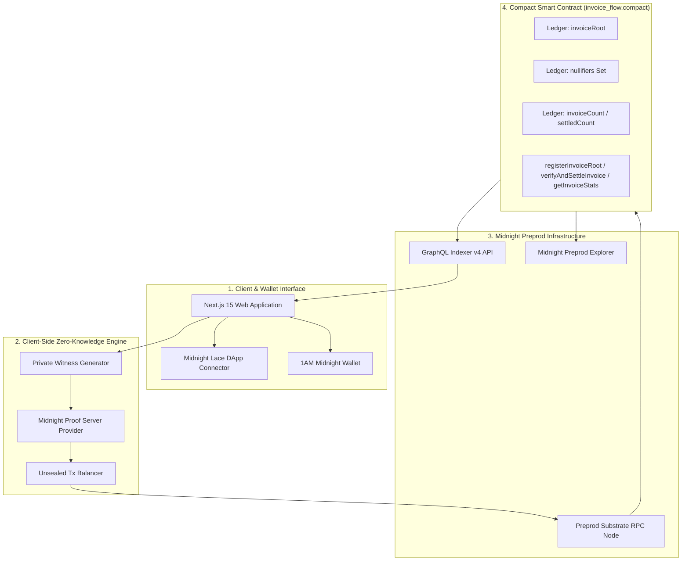
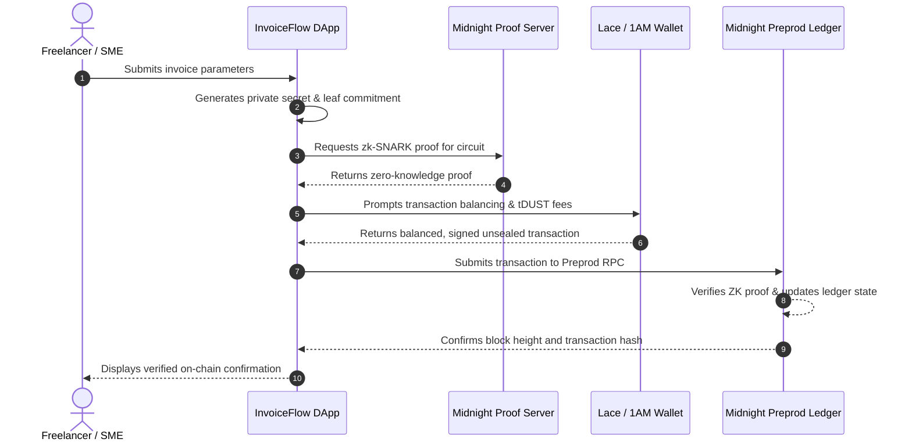

# 🏛️ InvoiceFlow: System Architecture & Component Blueprints

## 1. End-to-End System Topology

---

## 2. Component Specifications

### 2.1 Next.js 15 Frontend (`frontend/`)
- **Framework:** Next.js 15 App Router + React 19.
- **Styling:** Custom Cyberpunk Glassmorphism Dark Palette.
- **Key Modules:**
  - `src/app/page.tsx`: Real-time network telemetry, stats counter, live Preprod block ticker.
  - `src/app/submit/page.tsx`: PDF invoice autofill, confidential witness generation, and ZK Merkle root registration pipeline.
  - `src/app/verify/[id]/page.tsx`: Selective disclosure verification, `proveAccess` witness evaluation, proof export (JSON/XML).
  - `src/app/marketplace/page.tsx`: Shielded liquidity portal, risk-tier filtering, ZK yield projection, and settlement controls.

### 2.2 Compact Smart Contract (`contracts/compact/invoice_flow.compact`)
- **Version:** Compact v0.15+ (Preprod target).
- **Public Ledger State:**
  - `invoiceRoot: Bytes<32>` — Current committed Merkle root.
  - `issuer: ZswapCoinPublicKey` — Public key authorized to update roots.
  - `invoiceCount: Counter` — Total tokenized invoices.
  - `settledCount: Counter` — Total settled / repaid invoices.
  - `nullifiers: Set<Bytes<32>>` — Cryptographic nullifier anti-double-spend registry.
- **ZK Circuits:**
  - `registerInvoiceRoot(newRoot: Bytes<32>): []`
  - `verifyAndSettleInvoice(): []`
  - `getInvoiceStats(): [Bytes<32>, Uint<64>, Uint<64>]`

### 2.3 Midnight.js Integration (`frontend/src/lib/midnight.ts`)
- Configures real Midnight Preprod endpoints:
  - **Indexer:** `https://indexer.preprod.midnight.network/api/v4/graphql`
  - **Node RPC:** `https://rpc.preprod.midnight.network`
  - **Proof Server:** `https://proof.preprod.midnight.network`
- Automatically interfaces with `window.midnight.mnLace` and `window.midnight['1am']` to balance unsealed transactions with `tDUST` gas and broadcast signed transactions.

---

## 3. Transaction Data Flow & Lifecycle

